<div align="center">

# 🎮 WoT Clan Watcher

**Enterprise-grade World of Tanks clan monitoring and intelligence platform**

[](https://clanspy.win)
[](https://workers.cloudflare.com/)
[](https://nextjs.org/)
[](https://www.typescriptlang.org/)

**Track clan movements • Analyze player statistics • Get instant alerts**

[🚀 Live Demo](https://clanspy.win) • [📖 Documentation](#-getting-started) • [💬 Report Issues](https://github.com/ionutcnu/watcher/issues)

</div>

---

## ✨ Key Features

<table>
<tr>
<td width="50%">

### 🔐 **Multi-User Authentication**
- **Secure Login System** - Email/password with Better Auth
- **Admin Dashboard** - User management and system oversight
- **Role-Based Access** - Admin and user permissions
- **Session Management** - Secure authentication tokens

### 🔍 **Advanced Monitoring**
- **Automated Scanning** - Continuous clan roster tracking
- **Batch Processing** - Check 275+ clans automatically
- **Smart Batching** - 20 clans/batch to avoid rate limits
- **Display Order** - Preserve Excel import sequence

</td>
<td width="50%">

### 📊 **Player Analytics**
- **60-Day Statistics** - Recent performance metrics
- **WN8 Integration** - Tomato.gg advanced stats
- **On-Demand Loading** - Stats fetch when needed
- **Historical Tracking** - Complete movement history

### 🎯 **Bulk Operations**
- **CSV Import** - Import hundreds of clans at once
- **Bulk Actions** - Enable/disable/remove multiple clans
- **Progress Tracking** - Real-time batch progress
- **Error Handling** - Graceful failure recovery

</td>
</tr>
</table>

---

## 🎨 Modern Interface

- **🎭 Tactical Military Theme** - Immersive WoT-inspired design with hexagonal patterns
- **⚡ Smooth Animations** - Framer Motion & GSAP for fluid interactions
- **📱 Fully Responsive** - Perfect experience on all devices
- **🌙 Dark Mode Optimized** - Easy on the eyes for extended use
- **🔄 Real-Time Updates** - Live data without page refresh

---

## 🛠️ Technology Stack

### **Frontend**
```
Next.js 15.5  •  React 19  •  TypeScript 5  •  Tailwind CSS 4
Framer Motion  •  GSAP  •  Lucide Icons  •  Radix UI
```

### **Backend & Infrastructure**
```
Cloudflare Workers  •  Cloudflare D1 (SQLite)  •  OpenNext
Better Auth  •  Wrangler 4.43  •  Edge Runtime
```

### **APIs & Integrations**
```
Wargaming API  •  Tomato.gg  •  Discord Webhooks
```

### **Database Schema** (6 Tables)
| Table | Purpose |
|-------|---------|
| `user` | User accounts and authentication |
| `session` | Active user sessions |
| `monitored_clans` | Clan monitoring config (multi-user) |
| `snapshots` | Historical clan rosters |
| `changes` | Player movement tracking |
| `monitoring_config` | Global notification settings |

---

## 🚀 Quick Start

### **Prerequisites**
- Node.js 18+ and npm
- Cloudflare account (free tier works)
- Wargaming API key ([Get one free](https://developers.wargaming.net/))

### **Installation**

```bash
# Clone repository
git clone https://github.com/ionutcnu/watcher.git
cd watcher

# Install dependencies
npm install

# Set up environment variables
cp .env.example .env.local
# Edit .env.local with your API keys
```

### **Database Setup**

```bash
# Create D1 database
npx wrangler d1 create wot-watcher-db

# Update wrangler.toml with your database_id

# Initialize database (run migrations manually)
# SQL files are in your local directory only
```

### **Development**

```bash
# Start dev server
npm run dev

# Build for production
npm run build:worker

# Deploy to Cloudflare
npm run deploy

# Watch logs
npx wrangler tail
```

---

## 📖 Usage Guide

### **Adding Clans**

1. **Navigate to Monitoring** → Click "Bulk Import"
2. **Upload Excel/CSV** or paste clan tags
3. **Import** - Clans added in same order as Excel
4. **Enable/Disable** - Toggle monitoring per clan

### **Manual Scanning**

```
Click "Run Manual Check" → Automatic batch processing
├── Processes 20 clans per batch
├── Shows real-time progress
├── Displays results in Excel order
└── On-demand stats loading
```

### **View Changes**

- **Home Dashboard** - Recent movements across all clans
- **Filter by Date** - Custom date range selection
- **Last Scanned** - View only most recent scan results
- **Export Data** - Download as CSV/Excel

### **Admin Panel**

```
Admin Dashboard → Manage Users
├── View all registered users
├── Activate/deactivate accounts
├── Monitor system activity
└── Configure global settings
```

---

## 🏗️ Architecture

```mermaid
graph LR
    A[Browser] -->|HTTPS| B[Cloudflare Edge]
    B -->|API Routes| C[Next.js Server]
    C -->|Query| D[D1 Database]
    C -->|Fetch| E[Wargaming API]
    C -->|Stats| F[Tomato.gg]
    C -->|Notify| G[Discord]

    style A fill:#4A9EFF
    style B fill:#F38020
    style C fill:#000000
    style D fill:#FFA500
```



### **Key API Endpoints**

| Endpoint | Method | Purpose |
|----------|--------|---------|
| `/api/auth/[...all]` | ALL | Authentication (Better Auth) |
| `/api/admin/users` | GET/POST | User management |
| `/api/admin/settings` | GET/POST | System configuration |
| `/api/monitored-clans` | GET/POST | Clan CRUD operations |
| `/api/bulk-import` | POST | Batch clan import |
| `/api/monitoring/manual-check` | POST | Manual scan (batched) |
| `/api/clan-newsfeed` | GET | Clan events (bypass proxy) |
| `/api/player-stats` | POST | Tomato.gg statistics |
| `/api/changes` | GET | Player movement history |
| `/api/discord-notify` | POST | Send webhook notifications |

---

## ⚙️ Configuration

### **Environment Variables**

```env
# Wargaming API
WARGAMING_APPLICATION_ID=your_api_key
WARGAMING_REALM=eu
WARGAMING_API_BASE_URL=https://api.worldoftanks.eu

# Better Auth
BETTER_AUTH_SECRET=your_secret_key_here
BETTER_AUTH_URL=https://clanspy.win

# App Config
NEXT_PUBLIC_APP_NAME="WoT Clan Watcher"
NEXT_PUBLIC_APP_URL=https://clanspy.win
```

### **Wrangler Configuration**

```toml
name = "wot-clan-watcher"
compatibility_date = "2025-01-16"
compatibility_flags = ["nodejs_compat"]

[[d1_databases]]
binding = "DB"
database_name = "wot-watcher-db"
database_id = "your-database-id"

[vars]
WARGAMING_REALM = "eu"
WARGAMING_API_BASE_URL = "https://api.worldoftanks.eu"
NEXT_PUBLIC_APP_NAME = "WoT Clan Watcher"
NEXT_PUBLIC_APP_URL = "https://clanspy.win"
```

---

## 📊 Performance

| Metric | Value |
|--------|-------|
| **Response Time** | < 50ms (edge computing) |
| **Global CDN** | 300+ data centers |
| **Database** | SQLite at the edge |
| **Bundle Size** | < 7.5 MB optimized |
| **Batch Size** | 20 clans per request |
| **Max Clans** | Unlimited (automatic batching) |

---

## 🎯 Roadmap

- [x] Multi-user authentication system
- [x] Client-side automatic batching
- [x] Display order preservation
- [x] 60-day statistics integration
- [x] Admin panel for user management
- [x] Bulk operations (enable/disable/remove)
- [ ] Advanced filtering and search
- [ ] Customizable dashboards
- [ ] Email notifications
- [ ] API rate limiting
- [ ] Player comparison tools

---

## 🤝 Contributing

We welcome contributions! Here's how:

1. **Fork** the repository
2. **Create** a feature branch (`git checkout -b feature/amazing-feature`)
3. **Commit** your changes (`git commit -m 'Add amazing feature'`)
4. **Push** to branch (`git push origin feature/amazing-feature`)
5. **Open** a Pull Request

### **Development Guidelines**

- Follow TypeScript best practices
- Use Tailwind CSS for styling
- Write descriptive commit messages
- Test on Cloudflare Workers before PR
- Update README for new features

---

## 📝 License

This project is licensed under the **MIT License** - see [LICENSE](LICENSE) for details.

---

## 🙏 Acknowledgments

**Built with:**
- [Wargaming.net](https://developers.wargaming.net/) - World of Tanks API
- [Tomato.gg](https://tomato.gg/) - Advanced player statistics
- [Cloudflare](https://cloudflare.com/) - Edge computing & D1 database
- [OpenNext](https://opennext.js.org/) - Next.js on Cloudflare Workers
- [Better Auth](https://www.better-auth.com/) - Secure authentication

**Special thanks** to the World of Tanks community for feedback and support!

---

## 📧 Links

**🌐 Live Application:** [clanspy.win](https://clanspy.win)

**📚 API Documentation:** Wargaming API • Tomato.gg API

**💬 Support:** [Open an Issue](https://github.com/ionutcnu/watcher/issues)

---

<div align="center">

### Made with ❤️ for the World of Tanks Community

**⭐ Star this repo if you find it useful!**

[](https://github.com/ionutcnu/watcher)
[](https://github.com/ionutcnu/watcher/fork)

[⬆ Back to Top](#-wot-clan-watcher)

</div>
